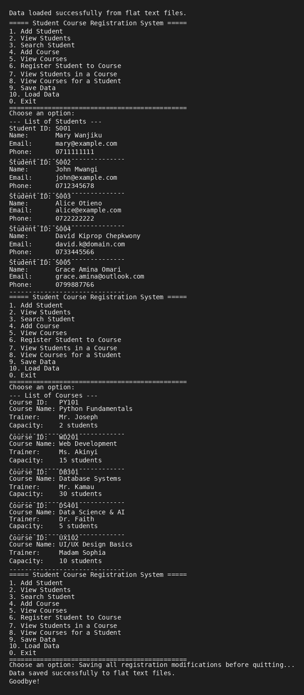
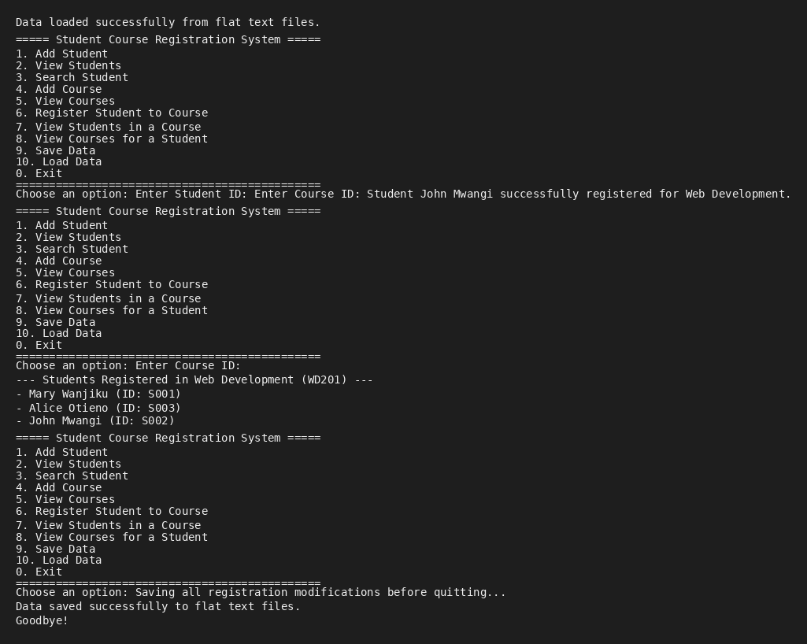

# Student Course Registration System

A modular, terminal-based Python application designed to help training institutions manage student enrollments, course catalogs, and academic registrations. The project demonstrates core principles of Object-Oriented Programming (OOP), explicit data validation, and flat-file data persistence.

## Features Implemented
* **Student Management:** Add new student profiles and search for students by name or unique ID.
* **Course Cataloging:** Establish courses with specific limits on student capacity and assign trainer profiles.
* **Enrollment Engine:** Safe registration mechanics that prevent duplicate student enrollments and enforce strict capacity boundaries.
* **Flat File Data Persistence:** Custom data serialization and deserialization routines to save and load records automatically via plain text files (`.txt`).
* **Defensive Error Handling:** Built-in safeguards that prevent application crashes due to unexpected user inputs or malformed lines in text data.

---

## Codebase Architecture & Classes

The project uses a modular folder structure to enforce a clean separation of concerns:

* **`Person` (Base Class):** Houses fundamental personal parameters (`name`, `email`, `phone_number`) used to demonstrate class inheritance.
* **`Student` (Child Class):** Inherits from `Person` while introducing unique identifiers (`student_id`) and overriding default printing layouts (`__str__`).
* **`Course` (Model Class):** Encapsulates details for individual modules, including IDs, instructional leads, and maximum classroom caps.
* **`SchoolSystem` (Service Class):** The core analytical hub managing active runtime lists, data cross-referencing, entry validations, and text-file input/output routines.

---

## Screenshots of the System in Action

### Viewing Students and Courses
The following screenshot demonstrates the system displaying the current list of registered students and available courses.

### Student Registration Flow
This screenshot shows the process of registering a student for a course and verifying the updated enrollment list.

